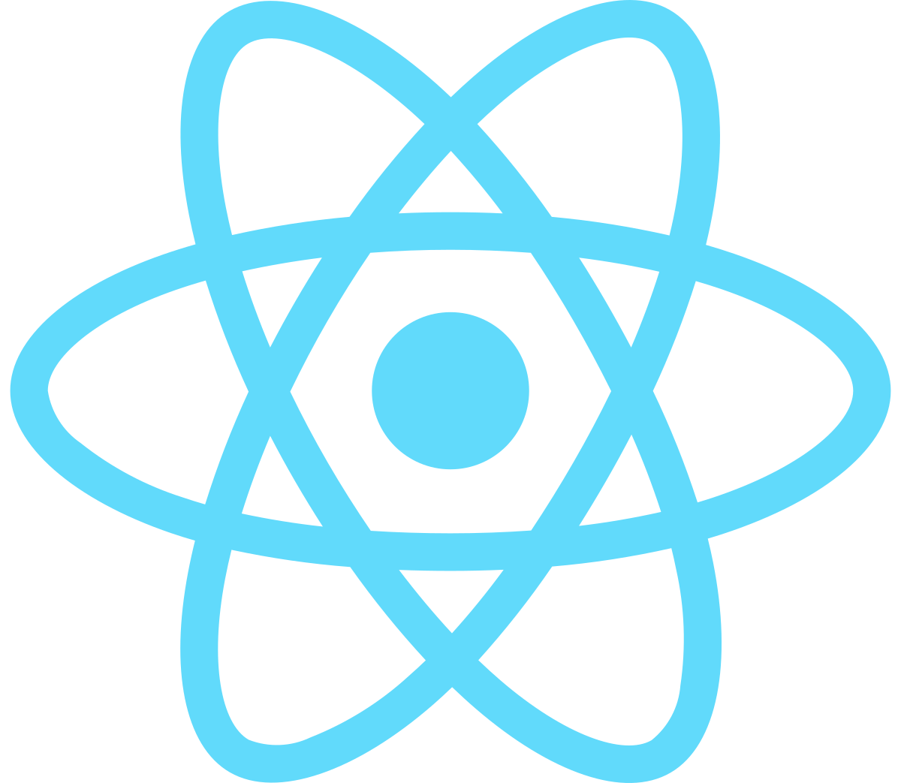

<h1 align="center">Hi 👋, I'm Pramutiha Madushan</h1>
<h3 align="center">Developer</h3>

  

- 🔭 I’m currently working on **GreenHouse Automate**

- 🌱 I’m currently learning **Undergraduate**

- 💬 Ask me about **Ask me about**

- ⚡ Fun fact **I am Funny**

<h3 align="cent">Connect with me:</h3>

<h1 align="center"> Languages/Frameworks I'm good at: </h1>

  <code></code>
  <code></code>
  <code></code>
  <code></code>
  <code></code>
  <code></code>
  <code></code>
  <code></code>
  <code></code>
  <code></code>
  <code></code>

 

<h1 align="center"> Languages/Frameworks I'm learning: </h1>

  <code></code>
  <code></code>
  <code></code>
  <code></code>
  <code></code>
  <code></code>

 

<h1 align="center"> Environments I work with: </h1>

  <code></code>
  <code></code>
  <code></code>
  <code></code>

 

